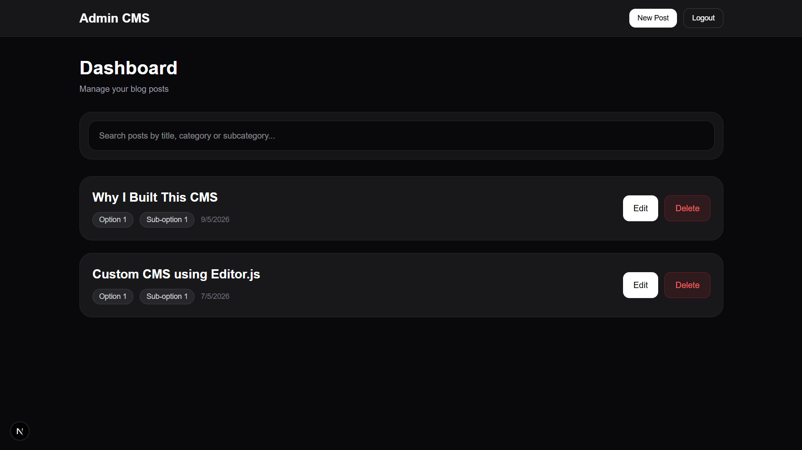
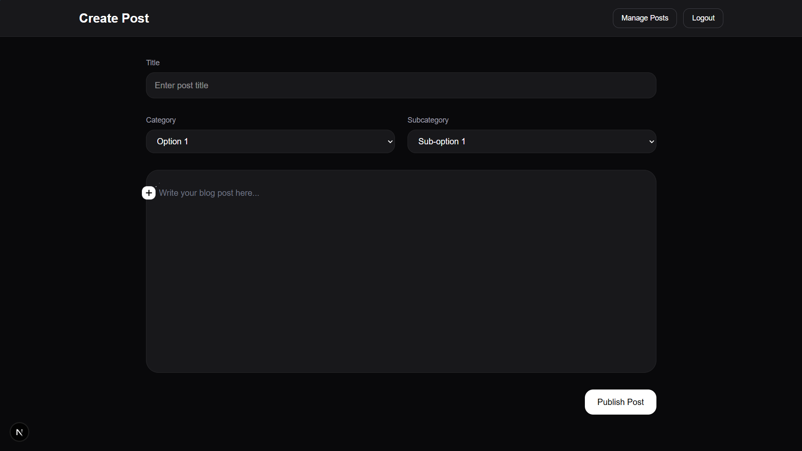
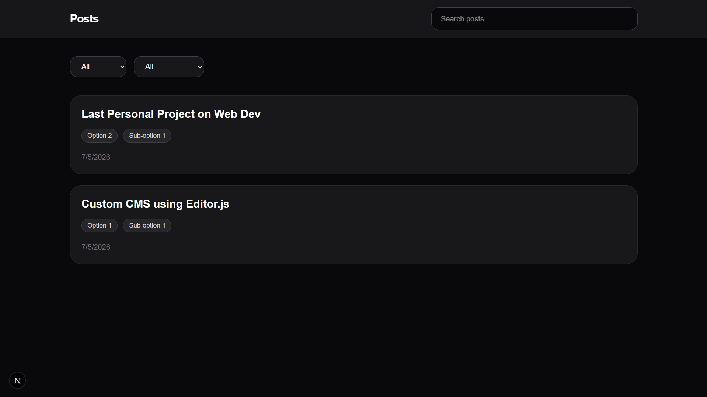
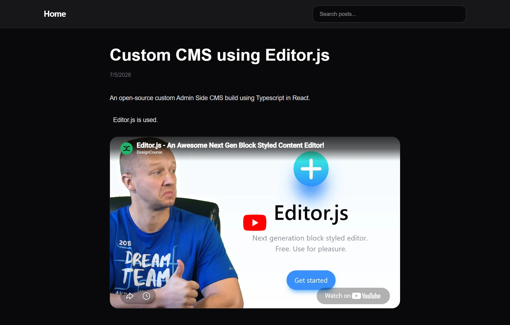

# Custom CMS Platform

A modern, full-stack content management system built with **Next.js 16**, **Supabase**, and **Editor.js** — split into two independent apps: an admin dashboard for content creation, and a public-facing blog viewer.


---

## Table of Contents

- [Overview](#overview)
- [Screenshots](#screenshots)
- [Features](#features)
- [Tech Stack](#tech-stack)
- [Repository Structure](#repository-structure)
- [Prerequisites](#prerequisites)
- [Quick Start](#quick-start)
  - [1. Clone the Repository](#1-clone-the-repository)
  - [2. Set Up Supabase](#2-set-up-supabase)
  - [3. Configure Environment Variables](#3-configure-environment-variables)
  - [4. Install & Run](#4-install--run)
- [Database Setup](#database-setup)
- [Storage Setup](#storage-setup)
- [Author](#author)
- [License](#license)

---

## Overview

This repository contains two Next.js applications that share the same Supabase backend:

| App | Description | Default Port |
|---|---|---|
| `admin-cms` | Password-protected dashboard for creating, editing, and deleting posts | `http://localhost:3000` |
| `user-cms` | Public blog with search, category filtering, and rich content rendering | `http://localhost:3001` |

---

## Screenshots

### Admin CMS

<table>
<tr>
<td align="center">
<b>Admin Dashboard</b><br><br>

</td>

<td align="center">
<b>Create Post</b><br><br>

</td>
</tr>
</table>

---

### Public Dashboard

<table>
<tr>
<td align="center">
<b>Public Blog Home</b><br><br>

</td>

<td align="center">
<b>Blog Post Page</b><br><br>

</td>
</tr>
</table>

---

## Features

### Admin CMS
- Supabase email/password authentication
- Create, edit, and delete posts
- Dashboard with live search
- Category & subcategory system
- Auto-generated URL slugs
- Unsaved changes protection (prevents accidental navigation away)
- Automatic media cleanup when a post is discarded
- Dark mode editor
- Fully responsive UI

### Editor.js — Supported Block Types
Rich text, Headers (H1–H6), Paragraphs, Lists (ordered & unordered), Checklists, Tables, Code blocks, Quotes, Warnings, Delimiters, Raw HTML, Embeds, Image uploads, Audio uploads, Video uploads, Carousel / gallery, Mermaid diagrams, LaTeX / KaTeX math, Custom blocks

### User CMS (Public Blog)
- Home page with latest-first post listing
- Dynamic blog post pages via slug routing
- Live search dropdown
- Category and subcategory filtering
- Full rendering of all Editor.js block types (carousels, media, Mermaid, KaTeX)
- Responsive design

---

## Tech Stack

| Layer | Technology |
|---|---|
| Framework | Next.js 16 (App Router) |
| Language | TypeScript 5 |
| Styling | Tailwind CSS v4 |
| Database | Supabase (PostgreSQL) |
| Auth | Supabase Auth |
| Storage | Supabase Storage |
| Editor | Editor.js + plugins |
| Diagrams | Mermaid |
| Math | KaTeX |

---

## Repository Structure

```
custom-cms/
├── admin-cms/
│   ├── app/
│   │   ├── api/posts/        # REST API routes (GET, POST, PUT, DELETE)
│   │   ├── api/upload/       # Media upload handler
│   │   ├── dashboard/        # Post listing & management
│   │   └── editor/           # New post & edit post pages
│   ├── components/           # Editor, LoginForm, Navbar, PostCard, media tools
│   ├── lib/                  # Supabase client & Editor.js config
│   ├── types/                # Shared TypeScript types (Post, EditorContent)
│   └── .env.example
├── user-cms/
│   ├── app/
│   │   ├── [slug]/           # Dynamic blog post page
│   │   └── page.tsx          # Home page
│   ├── components/           # Navbar, PostCard, RenderBlocks, SearchDropdown
│   ├── lib/                  # Supabase client
│   ├── types/                # Shared TypeScript types
│   └── .env.example
├── README.md
├── LICENSE
└── .gitignore
```

---

## Prerequisites

Before you begin, make sure you have the following installed:

- **Node.js** v18 or later
- **npm** v9 or later (or yarn/pnpm)
- A free [Supabase](https://supabase.com) account

### Editor.js Plugins
 
The admin editor depends on the following Editor.js packages. They are included in `admin-cms/package.json` and will be installed automatically via `npm install`, but you can also install them manually:
 
```bash
npm install \
  @editorjs/editorjs \
  @editorjs/header \
  @editorjs/paragraph \
  @editorjs/list \
  @editorjs/checklist \
  @editorjs/quote \
  @editorjs/warning \
  @editorjs/code \
  @editorjs/raw \
  @editorjs/table \
  @editorjs/delimiter \
  @editorjs/embed \
  @editorjs/image \
  @editorjs/simple-image \
  @editorjs/marker \
  editorjs-carousel \
  editorjs-math \
  editorjs-mermaid \
  mermaid \
  katex
```
 
| Package | Purpose |
|---|---|
| `@editorjs/editorjs` | Core Editor.js engine |
| `@editorjs/header` | H1–H6 heading blocks |
| `@editorjs/paragraph` | Default text block |
| `@editorjs/list` | Ordered & unordered lists |
| `@editorjs/checklist` | Interactive checklists |
| `@editorjs/quote` | Pull quote blocks |
| `@editorjs/warning` | Warning/callout blocks |
| `@editorjs/code` | Syntax-highlighted code blocks |
| `@editorjs/raw` | Raw HTML blocks |
| `@editorjs/table` | Table blocks |
| `@editorjs/delimiter` | Section dividers |
| `@editorjs/embed` | oEmbed / iframe embeds |
| `@editorjs/image` | Image upload blocks |
| `@editorjs/simple-image` | Image via URL (no upload) |
| `@editorjs/marker` | Text highlight/marker |
| `editorjs-carousel` | Image carousel / gallery |
| `editorjs-math` | LaTeX math input via KaTeX |
| `editorjs-mermaid` | Mermaid diagram blocks |
| `mermaid` | Mermaid diagram renderer |
| `katex` | KaTeX math renderer |

---

## Quick Start

### 1. Clone the Repository

```bash
git clone https://github.com/rituraj-mandi/custom-cms.git
cd custom-cms
```

### 2. Set Up Supabase

1. Go to [supabase.com](https://supabase.com) and create a new project.
2. Once the project is ready, navigate to **Project Settings → API**.
3. Copy your **Project URL** and **anon public key** — you'll need them in the next step.
4. Run the [database setup](#database-setup) SQL and configure [storage](#storage-setup) as described below.

### 3. Configure Environment Variables

Create `.env.local` files for both apps by copying the examples:

```bash
cp admin-cms/.env.example admin-cms/.env.local
cp user-cms/.env.example user-cms/.env.local
```

Then open each file and fill in your Supabase credentials:

```env
NEXT_PUBLIC_SUPABASE_URL=https://your-project-id.supabase.co
NEXT_PUBLIC_SUPABASE_ANON_KEY=your-anon-key-here
```

### 4. Install & Run

Both apps run simultaneously. Open **two terminals**:

**Terminal 1 — Admin CMS** (runs on `http://localhost:3000`)
```bash
cd admin-cms
npm install
npm run dev
```

**Terminal 2 — User CMS** (runs on `http://localhost:3001`)
```bash
cd user-cms
npm install
npm run dev -- --port 3001
```

---

## Database Setup

In your Supabase project, open the **SQL Editor** and run the following:

```sql
create table posts (
  id           uuid        default gen_random_uuid() primary key,
  title        text        not null,
  slug         text        unique not null,
  category     text,
  subcategory  text,
  thumbnail_url text,
  content      jsonb,
  created_at   timestamptz default now()
);
```

### Row Level Security (RLS) Policies
 
After creating the table, enable RLS and add the following policies so that the public blog can read posts freely while only authenticated admins can write.
 
**Enable RLS on the posts table:**
 
```sql
alter table posts enable row level security;
```
 
**Then add these four policies:**
 
| Policy | Operation | Who | Expression |
|---|---|---|---|
| Public read | `SELECT` | Anyone | `true` |
| Authenticated insert | `INSERT` | Authenticated users | `auth.role() = 'authenticated'` |
| Authenticated update | `UPDATE` | Authenticated users | `auth.role() = 'authenticated'` |
| Authenticated delete | `DELETE` | Authenticated users | `auth.role() = 'authenticated'` |
 
Or run all four at once in the SQL Editor:
 
```sql
-- Allow anyone to read posts (used by user-cms)
create policy "Public read posts"
  on "public"."posts"
  as PERMISSIVE
  for SELECT
  to public
  using (true);
 
-- Allow authenticated admins to create posts
create policy "Authenticated insert posts"
  on "public"."posts"
  as PERMISSIVE
  for INSERT
  to authenticated
  with check (true);
 
-- Allow authenticated admins to update posts
create policy "Authenticated update posts"
  on "public"."posts"
  as PERMISSIVE
  for UPDATE
  to authenticated
  using (true);
 
-- Allow authenticated admins to delete posts
create policy "Authenticated delete posts"
  on "public"."posts"
  as PERMISSIVE
  for DELETE
  to authenticated
  using (true);
```
 
> **Why this matters:** Without RLS enabled, the `posts` table is open to anyone with your anon key. These policies ensure your public blog can read posts while only a signed-in admin can create, edit, or delete them.
 
---

## Storage Setup

### 1. Create the bucket

1. In your Supabase project, go to **Storage**.
2. Click **New bucket**, name it `media`, and enable **Public bucket**.

### 2. Set access policies

Navigate to **Storage → Policies** and add the following four policies for the `media` bucket:

| Policy | Operation | Expression |
|---|---|---|
| Public read | `SELECT` | `true` |
| Authenticated upload | `INSERT` | `auth.role() = 'authenticated'` |
| Authenticated update | `UPDATE` | `auth.role() = 'authenticated'` |
| Authenticated delete | `DELETE` | `auth.role() = 'authenticated'` |

---

## Author

**Rituraj Mandi**  
GitHub: [github.com/rituraj-mandi](https://github.com/rituraj-mandi)

---

## License

This project is licensed under the [MIT License](LICENSE).
